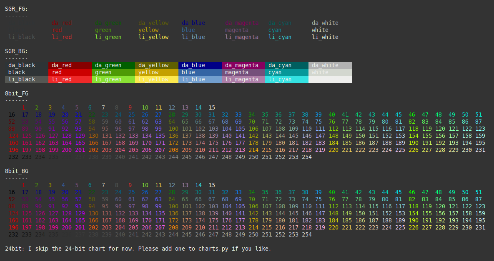
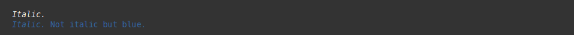
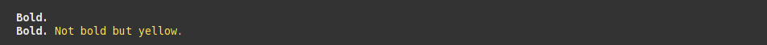
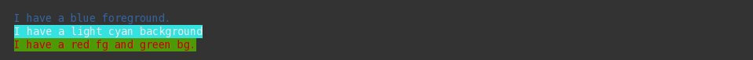
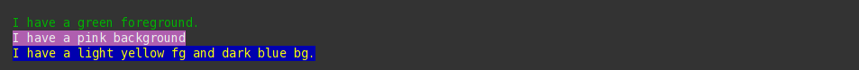
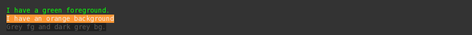
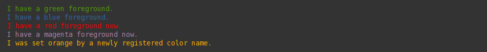

# sty

  

## Description

Simple, flexible and extensible string styling for your terminal.

Sty has no dependencies and consists of only ~200 LOC (including empty lines and comments).


## Getting Started

```
pip install sty
```

You can import sty like this:
 
```python
import sty
```

However, if you need to style a lot of stuff, you might consider importing the 
style objects directly, like this:

```python
from sty import fg, bg, ef, rs
```

*Sty* all the strings!

```python
foo = fg.red + 'This is red text!' + fg.rs
bar = bg.blue + 'This has a blue background!' + bg.rs
baz = ef.italic + 'This is italic text' + rs.italic
qux = fg(201) + 'This is pink text using 8bit colors' + fg.rs
qui = fg(255, 10, 10) + 'This is red text using 24bit colors.' + fg.rs

# Add new colors:
from sty import render
fg.orange = render.rgb_fg(255, 150, 40)

buf = fg.orange + 'Yay, Im orange.' + fg.rs

print(foo, bar, baz, qux, qui, buf, sep='\n')
```

output:
 
  
    
## Documentation:

* [List of default effects](#list-of-default-effects)
* [List of default colors](#list-of-default-colors)
* [Italic](#italic)
* [Bold](#bold)
* [Underline](#underline)
* [Coloring by name](#string-coloring-by-name)
* [Coloring with 8bit](#string-coloring-using-8-bit-numbers)
* [Coloring with 24bit (rgb, truecolor)](#string-coloring-using-24-bit-rgb-values)
* [Customizing](#customizing-sty)
* [Terminal Support](#terminal-support)


### A little Walkthrough the primitives 

There is a bunch of tiny, but flexible primitives that are used for styling your strings: 

* `ef` (effects)
* `fg` (foreground)
* `bg` (background)
* `rs` (reset).

Each primitive carries a default selection of attributes, which you can select like this:

```python
ef.italic
fg.blue
bg.green
rs.all
```

Or like this, which is nice in case you need to dynamically select attributes:

```python
ef('italic')
fg('blue')
bg(my_dynamic_color)
rs('all')
```

`fg` and `bg` are special in the way that they allow you to select 8bit and 24bit colors directly:

```python
fg(242)  # select an 8bit color directly.
bg(49, 233, 150)  # select a 25bit rgb color directly.
```
  
Sty allows you to change or extend the default attributes as you like, using the render functions:

```python
from sty import render

ef.italic = render.sgr(1)  # ef.italic now renders bold text.
fg.red = render.sgr(32)  # fg.red renders green text from now on.
fg.blue = render.eightbit_bg(111)  # fg.blue renders blue text from now on (using an 8bit color code).
bg.green = render.rgb(0, 128, 255)  # bg.green renders blue text from now on (using a 24bit rgb code).
rs.all = render.sgr(24)  # rs.all only resets the underline effect from now on.
```

In case you need to set something dynamically you can use the `set` method:

```python
my_color_name = 'red'

fg.set(my_color_name, render.sgr(32))  # fg.red renders green text from now on.
```

If you want to apply a larger register of custom attributes, applying them like this might be more convenient.

```python
from sty.register import DefaultFg 
from sty.render import sgr, rgb_fg


# Extend default Fg register.
class MyFgRegister(DefaultFg):
    black = sgr(31)
    red = sgr(34)
    orange = rgb_fg(10, 40, 133)

fg = MyFgRegister()
```

You can also start your own register from scratch by inheriting the clean base classes:

```python
from sty.primitive import Fg
from sty.render import sgr, rgb_fg

# Create a register from scratch.
class MyFgRegister(Fg):
    black = sgr(31)
    red = sgr(34)
    orange = rgb_fg(10, 40, 133)

fg = MyFgRegister()
```


More on customizing and the section below. 

#### `ef`

`sty.ef`

The `ef` object provides effects like *italic*, *bold*, *strike*, etc. 

 TODO: finish this section.


### List of default effects

More info: [SGR](https://en.wikipedia.org/wiki/ANSI_escape_code#SGR_(Select_Graphic_Rendition)_parameters)

| Effect               | Description |
| -------------------- | ------------- |
| bold (alias b)       | Bold or increased intensity  |
| faint                | Decreased intensity  |
| italic (alias i)     | Italic.. |
| underline (alias u)  | Underline..|
| blink_slow           | Blink less than 150 per minute |
| blink_fast           | Blink more than 150 per minute |
| reverse              | Reverse fore- and background |
| conceal              | Conceal/Hide |
| strike               | Striketrhough | 


### List of default colors

More info: [3/4 bit color table](https://en.wikipedia.org/wiki/ANSI_escape_code#3/4_bit).

| normal   | light |
| -------- | ----- |
| black    | li_black | 
| red      | li_red |
| green    | li_green |
| yellow   | li_yellow |
| blue     | li_blue |
| magenta  | li_magenta |
| cyan     | li_cyan |
| white    | li_white |


Notice: Color names/values can be modified/extended. See [customizing sty](#customizing-sty) below.


### Italic

```python
a = ef.italic + 'Italic.' + rs.italic

# Shorthand version:
b = ef.i + fg.blue + 'Italic.' + rs.i + ' Not italic but blue.' + rs.fg

print(a, b, sep='\n')
```

  

### Bold

```python
a = ef.bold + 'Bold.' + rs.bold

# Shorthand version:
b = ef.b + 'Bold.' + rs.b + fg.li_yellow + ' Not bold but yellow.' + rs.fg

print(a, b, sep='\n')
```

  

### Underline

```python
a = ef.underline + 'Underlined.' + rs.underline

# Shorthand version:
b = ef.u + 'Underlined.' + rs.u + fg.green + ' Not underlined but green.' + rs.fg

print(a, b, sep='\n')
```

  

#### TODO

Add examples for, strike, blink, etc..


### String coloring by name

```python
a = fg.blue + 'I have a blue foreground.' + rs.fg
b = bg.li_cyan + 'I have a light cyan background' + rs.bg
c = fg.red + bg.green + 'I have a red fg and green bg.' + rs.all

print(a, b, c, sep='\n')
```

  


### String coloring using 8-bit numbers

```python
a = fg(34) + 'I have a green foreground.' + rs.fg
b = bg(133) + 'I have a pink background' + rs.bg
c = fg(226) + bg(19) + 'I have a light yellow fg and dark blue bg.' + rs.all

print(a, b, c, sep='\n')
```

  
    
Link: [Info on 8-bit numbers][1]


### String coloring using 24-bit RGB values

```python
a = fg(10, 255, 10) + 'I have a green foreground.' + rs.fg
b = bg(255, 150, 50) + 'I have an orange background' + rs.bg
c = fg(90, 90, 90) + bg(32, 32, 32) + 'Grey fg and dark grey bg.' + rs.all

print(a, b, c, sep='\n')
```

  

Link: [Info on 24-bit numbers][2]


### Customizing sty

If you want to change/add attributes to your sty objects (fg, bg, ef, rs) you can use a dict and the rendering methods provided by `sty.render` to do so:

```python
custom_colors= dict(
    orange=render.eightbit_fg(214),  # Add 'orange' to fg (using 8-bit code)
    green=render.rgb_fg(255, 0, 0),  # Modify value for 'green' (using rgb code)
    blue=render.sgr(95),  # Turn 'blue' into magenta (using sgr code)
)

a = fg.green + 'I have a green foreground.' + rs.fg
b = fg.blue + 'I have a blue foreground.' + rs.fg

fg(custom_colors)

c = fg.green + 'I have a red foreground now.' + rs.fg
d = fg.blue + 'I have a magenta foreground now.' + rs.fg
e = fg.orange + 'I was set orange by a newly registered color name.' + rs.fg

print(a, b, c, d, e, sep='\n')
```

  

As you see, there are three types of renders:

* `sgr` This one is used to generate ansi strings for SGR "Select Graphic Rendition" codes. These are most widely supported. They can be used for colors, as well as styling (italic, bold, blink, etc.). [Link][0]
* `eigthbit`: This one is used to generate ansi strings for 8-bit colors. [Link][1]
* `rgb`: This one is used to generate ansi strings for 24-bit colors. [Link][2]

## Terminal Support

This was initially tested on Arch Linux using 'Termite' terminal. If you have issues with your setup, please leave an issue. If sty works fine on your setup, feel free to add your setup to the list below:

#### Termite on Linux

| Option        | Status  |
| ------------- | ------- |
| SGR:          | Ok!     |
| 8-bit color:  | Ok!     |
| 24-bit color: | Ok!     |

If you want to support the widest range of terminals, you should stick to the sgr renderer. The default attributes in all sty objects (`fb`,`bg`,`ef`,`rs`) use `sgr` values exclusively.


[0]: https://en.wikipedia.org/wiki/ANSI_escape_code#SGR_(Select_Graphic_Rendition)_parameters
[1]: https://en.wikipedia.org/wiki/ANSI_escape_code#8-bit
[2]: https://en.wikipedia.org/wiki/ANSI_escape_code#24-bit
