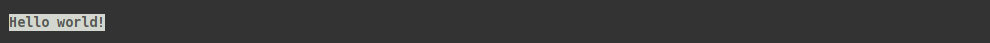

# sty

  

## Description

Simple, intuitive and extensible string styling for your terminal.

Sty has no dependencies and consists of ~ 170 LOC (incl. empty lines).


## Getting Started

**Install Sty:**:

```
pip install sty
```

**Import sty:**

You can import sty like this:
 
```python
import sty
```

However, if you need to style a lot of stuff, you might consider importing the 
style objects directly, like this:

```python
from sty import fg, bg, ef, rs
```

**Use sty:**

Style all the strings:

```python
my_string = fg.blue + bg.li_red + ef.bold + 'Hello world!' + rs.all
```
 
  
    
## Documentation:

* [List of style effects](#list-of-style-effects)
* [List of default color names](#list-of-default-color-names)
* [Italic](#italic)
* [Bold](#bold)
* [Underline](#underline)
* [Coloring by name](#string-coloring-by-name)
* [Coloring with 8bit](#string-coloring-using-8-bit-numbers)
* [Coloring with 24bit (rgb, truecolor)](#string-coloring-using-24-bit-rgb-values)
* [Customizing](#customizing-sty)
* [Terminal Support](#terminal-support)

### List of style effects

The `ef` (effect) object provides you with some string style effects.
These are supported by default:

| First Header         | Second Header |
| -------------------- | ------------- |
| bold (alias b)       | Bold or increased intensity  |
| faint                | Decreased intensity  |
| italic (alias i)     | Italic.. |
| underline (alias u)  | Underline..|
| blink_slow           | Blink less than 150 per minute |
| blink_fast           | Blink more than 150 per minute |
| reverse              | Reverse fore- and background |
| conceal              | Conceal/Hide |
| strike               | Striketrhough | 

Note: Terminal support for these varies.

### List of default color names

The default list of names relates to the classic [3/4 bit color table](https://en.wikipedia.org/wiki/ANSI_escape_code#3/4_bit), supported by most terminals. 

These are the names provided by default:

* black
* red
* green
* yellow
* blue
* magenta
* cyan
* white
* li_black
* li_red
* li_green
* li_yellow
* li_blue
* li_magenta
* li_cyan
* li_white

Notice: Color names/values can be modified/extended. See [customizing sty](#customizing-sty) below.


### Italic

```python
a = ef.italic + 'Italic.' + rs.italic

# Shorthand version:
b = ef.i + fg.blue + 'Italic.' + rs.i + ' Not italic but blue.' + rs.fg

print(a, b, sep='\n')
```

  

### Bold:

```python
a = ef.bold + 'Bold.' + rs.bold

# Shorthand version:
b = ef.b + 'Bold.' + rs.b + fg.li_yellow + ' Not bold but yellow.' + rs.fg

print(a, b, sep='\n')
```

  

### Underline:

```python
a = ef.underline + 'Underlined.' + rs.underline

# Shorthand version:
b = ef.u + 'Underlined.' + rs.u + fg.green + ' Not underlined but green.' + rs.fg

print(a, b, sep='\n')
```

  

#### TODO:

Add examples for, strike, blink, etc..


### String coloring by name:

```python
a = fg.blue + 'I have a blue foreground.' + rs.fg
b = bg.li_cyan + 'I have a light cyan background' + rs.bg
c = fg.red + bg.green + 'I have a red fg and green bg.' + rs.all

print(a, b, c, sep='\n')
```

  


### String coloring using 8-bit numbers:

```python
a = fg(34) + 'I have a green foreground.' + rs.fg
b = bg(133) + 'I have a pink background' + rs.bg
c = fg(226) + bg(19) + 'I have a light yellow fg and dark blue bg.' + rs.all

print(a, b, c, sep='\n')
```

  
    
Link: [Info on 8-bit numbers][1]


### String coloring using 24-bit RGB values:

```python
a = fg(10, 255, 10) + 'I have a green foreground.' + rs.fg
b = bg(255, 150, 50) + 'I have an orange background' + rs.bg
c = fg(90, 90, 90) + bg(32, 32, 32) + 'Grey fg and dark grey bg.' + rs.all

print(a, b, c, sep='\n')
```

  

Link: [Info on 24-bit numbers][2]


### Customizing sty

If you want to change/add attributes to your sty objects (fg, bg, ef, rs) you can use a dict and the rendering methods provided by `sty.render` to do so:

```python
custom_register = dict(
    orange=render.eightbit_fg(214),  # Add 'orange' to fg (using 8-bit code)
    green=render.rgb_fg(255, 0, 0),  # Modify value for 'green' (using rgb code)
    blue=render.sgr(95),  # Turn 'blue' into magenta (using sgr code)
)

a = fg.green + 'I have a green foreground.' + rs.fg
b = fg.blue + 'I have a blue foreground.' + rs.fg

fg(custom_register)

c = fg.green + 'I have a red foreground now.' + rs.fg
d = fg.blue + 'I have a magenta foreground now.' + rs.fg
e = fg.orange + 'I was set orange by a newly registered color name.' + rs.fg

print(a, b, c, d, e, sep='\n')
```

  

As you see, there are three types of renders:

* `sgr` This one is used to generate ansi strings for SGR "Select Graphic Rendition" codes. These are most widely supported. They can be used for colors, as well as styling (italic, bold, blink, etc.). [Link][0]
* `eigthbit`: This one is used to generate ansi strings for 8-bit colors. [Link][1]
* `rgb`: This one is used to generate ansi strings for 24-bit colors. [Link][2]

## Terminal Support

This was initially tested on Arch Linux using 'Termite' terminal. If you have issues with your setup, please leave an issue. If sty works fine on your setup, feel free to add your setup to the list below:

#### Termite on Linux

* SGR: Fine!
* 8-bit color: Fine!
* 24-bit color: Fine!

If you want to support the widest range of terminals, you should stick to the sgr renderer. The default attributes in all sty objects (`fb`,`bg`,`ef`,`rs`) use `sgr` values exclusively.


[0]: https://en.wikipedia.org/wiki/ANSI_escape_code#SGR_(Select_Graphic_Rendition)_parameters
[1]: https://en.wikipedia.org/wiki/ANSI_escape_code#8-bit
[2]: https://en.wikipedia.org/wiki/ANSI_escape_code#24-bit
